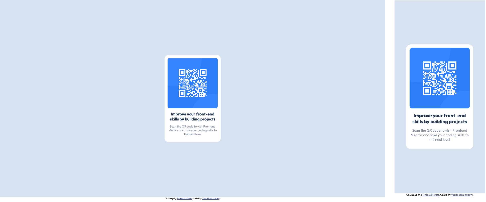

# Frontend Mentor - QR code component solution

This is a solution to the [QR code component challenge on Frontend Mentor](https://www.frontendmentor.io/challenges/qr-code-component-iux_sIO_H). Frontend Mentor challenges help you improve your coding skills by building realistic projects. 

## Table of contents

- [Overview](#overview)
  - [Screenshot](#screenshot)
  - [Links](#links)
- [My process](#my-process)
  - [Built with](#built-with)
  - [Useful resources](#useful-resources)
- [Author](#author)

## Overview

### Screenshot

### Links

- Solution URL: [solution URL](https://www.frontendmentor.io/solutions/created-using-custom-css-and-flexbox-GpGdpIou43)
- Live Site URL: [URL - 1](https://qr-code-component-ape.pages.dev/)
- Live Site URL: [URL - 2](https://ultrahash.in/projects/qr-code-component/)

## My process

### Built with

- Semantic HTML5 markup
- CSS custom properties
- Flexbox
- Mobile-first workflow
- [Google Fonts](https://fonts.google.com/specimen/Outfit?query=Outfit) - For Font styles

### Useful resources

- [Fonts resource 1](https://fonts.google.com/) - This helped me get the necessary font style to complete this project.

## Author

- Website - [veerabhadra swamy](https://www.ultrahash.in)
- Frontend Mentor - [@ultra-hash](https://www.frontendmentor.io/profile/ultra-hash)
